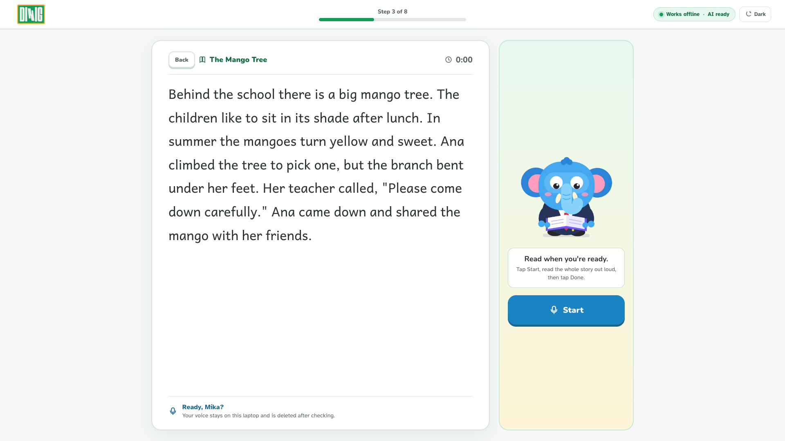
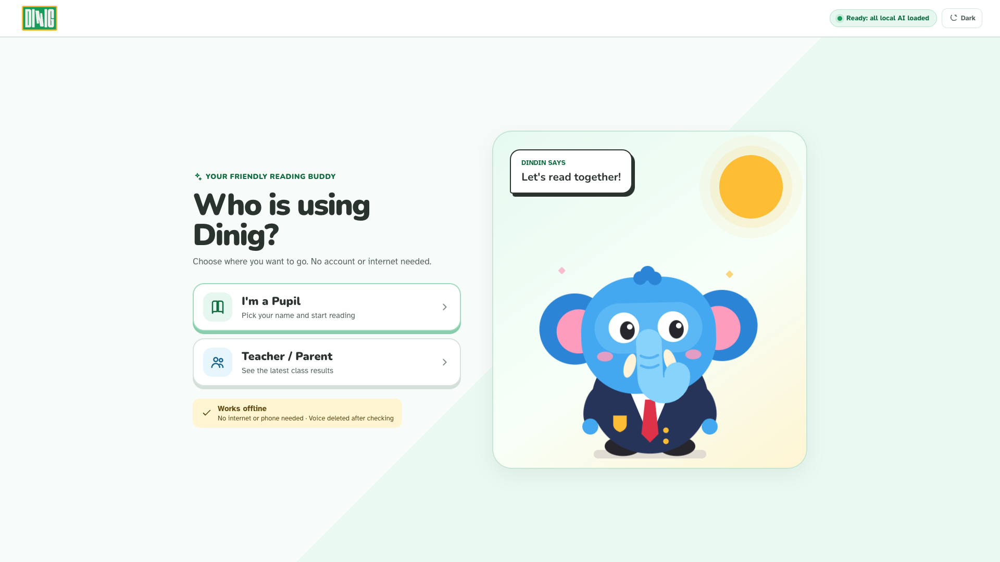
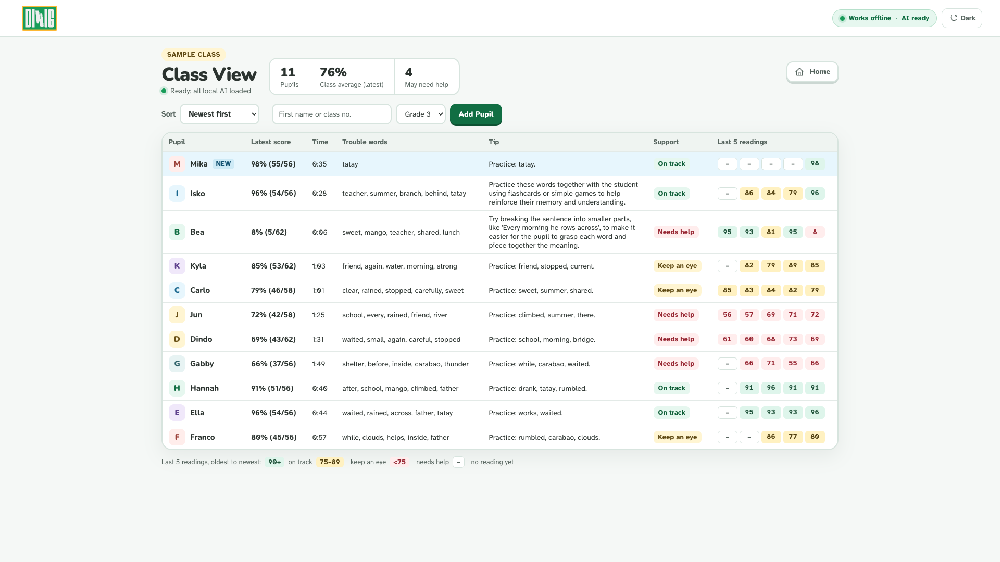

# Dinig

Dinig: pupils read stories aloud and get instant word-by-word feedback, fully offline on a school laptop.



## The problem

Many Filipino pupils struggle to read a simple text. One teacher cannot listen to every child read aloud every day. Many public schools have weak internet or none, so a reading app that needs the cloud does not reach them.

The World Bank estimates that 91% of 10-year-old Filipino children are in learning poverty, meaning they cannot read and understand a simple text ([source](https://newsinfo.inquirer.net/1632864/wb-ph-learning-poverty-among-highest-in-region)).

## Why does this product benefit from running AI locally?

- It works in schools with no internet. After setup, speech checking and the language model both run on the laptop.
- Children's voices never leave the laptop. The recording is scored on the machine and deleted. Only the score, the time, and the trouble words are saved.
- There is no per-use cost for schools.
- It runs on the 8GB laptops schools already have. No graphics card is required.

## Demo

Demo video and post: [LinkedIn link coming soon](LINKEDIN_LINK_HERE)






## Features

- **Read aloud.** The pupil reads a short story. Each word turns green (correct), yellow (practice word), or grey (skipped). The screen shows the score and the reading time.
- **Story Quiz.** Qwen writes questions from the story. The pupil answers out loud.
- **Practice Again.** Qwen writes new sentences that use the pupil's practice words.
- **Class View** for teachers and parents. It shows scores, trouble words, a tip, and a heatmap of the last 5 readings.
- Light and dark mode, large text, no login, and no phone.

## What runs locally

| Part | Runs on the laptop |
| --- | --- |
| Speech checking (faster-whisper) | Yes |
| Quiz, practice sentences, and tips (Qwen2.5 via Ollama) | Yes |
| Audio processing (ffmpeg, included with the Python packages) | Yes |
| Database (SQLite, one file) | Yes |
| The app itself | Yes |

Recordings are deleted after checking. Read and Check, the quiz, and Practice Again each delete the audio file when scoring finishes. A leftover file in `temp` is deleted the next time the app starts.

## What requires internet

Nothing during use. Internet is only needed once, during setup, to download the models.

## Run it yourself (Windows)

Minimum laptop: 8GB RAM, Windows 10 or 11, no graphics card. These downloads are the ones this project uses:

- Whisper small: 464MB (the `model.bin` file is 461MB; the rest is the tokenizer)
- Qwen2.5 3B: 1.9GB ([Ollama library](https://ollama.com/library/qwen2.5))
- Qwen2.5 1.5B, the smaller fallback: 986MB (same page)

1. Install **Python 3.12.10** (64-bit) from https://www.python.org/downloads/release/python-31210/. On the first screen, tick **Add python.exe to PATH**.
2. Install **Git** from https://git-scm.com/download/win.
3. Install **Ollama** from https://ollama.com/download/windows. It starts in the system tray.
4. Open a new Command Prompt and check the tools:

```
py -3.12 --version
git --version
ollama --version
```

5. Get the code:

```
cd %USERPROFILE%\Desktop
git clone https://github.com/jayveedelarosa/dinig.git dinig
cd dinig
```

6. Create the Python environment and install packages. ffmpeg comes inside `imageio-ffmpeg`, so there is no separate ffmpeg install.

```
py -3.12 -m venv venv
venv\Scripts\python.exe -m pip install --upgrade pip
venv\Scripts\python.exe -m pip install -r requirements.txt
```

7. Download the language models:

```
ollama pull qwen2.5:3b
ollama pull qwen2.5:1.5b
venv\Scripts\python.exe backend\download_models.py
```

8. Create settings and load the sample class (10 made-up pupils, demo pupil Mika, 3 stories). `seed.py` resets the database. Run it again any time you want a clean demo.

```
copy .env.example .env
venv\Scripts\python.exe backend\seed.py
```

9. Double-click **`start_dinig.bat`**. It starts the server and opens Dinig in its own window. The first time, click **Allow** when the browser asks for the microphone.

To test offline, turn off Wi-Fi and read a story.

The window looks for Microsoft Edge, then Google Chrome. If neither is installed, it opens the usual browser. Always use the window the launcher opens. The address is `http://localhost:8000`. That is what allows the microphone.

To stop Dinig, close the Dinig window, then close the minimized "Dinig server" window.

## Minimum laptop

8GB RAM, no graphics card needed.

## Disclosures

- **Models used:**
  - faster-whisper small, 464MB on disk: https://huggingface.co/Systran/faster-whisper-small (MIT). The original Whisper model is by OpenAI.
  - Qwen2.5 3B, 1.9GB, via Ollama: https://ollama.com/library/qwen2.5. Qwen2.5 3B is under the [Qwen Research License](https://qwenlm.github.io/blog/qwen2.5-llm/).
  - Qwen2.5 1.5B, 986MB, the fallback: same Ollama page. Qwen2.5 1.5B is Apache 2.0.
  - Plan B (an MMS aligner) is not used.
- **Technologies:** Python, FastAPI, SQLite, HTML/CSS/JS, Ollama, ffmpeg (via imageio-ffmpeg), Microsoft Edge or Chrome in app mode.
- **APIs and cloud services:** None.
- **Existing code and assets:** fonts Andika (SIL), Atkinson Hyperlegible (Braille Institute), and Nunito, all SIL Open Font License. The license files are in `frontend/fonts/`. The UI design was made by Jerich in Figma Make during the hackathon. Everything else was built during the hackathon.
- **AI development tools:** Claude Code (building and testing), Codex (Qwen integration), Figma Make (UI design), Claude chat (planning).
- The Dindin mascot and logo were made by Jerich De Venecia during the hackathon.

## Team

Team: Out of Tokens

Jayvee Dela Rosa: Team lead and project manager. Planning, product direction, frontend restyle and integration.

Bian Avan Toledo: Backend and local AI. Whisper speech checking, Qwen integration, Windows installer.

Jerich De Venecia: Frontend and design. UI design in Figma Make, the Dindin mascot and logo.

Jersylle Nismal: Research and pitch. Stories, problem research, pitch.

## Limitations

- The sample class has 3 English stories.
- Whisper's accuracy on Filipino-accented English has not been measured.
- If Qwen is slow or not running, the quiz uses 2 saved questions and Practice Again uses simple template sentences. The reading check still runs.
- Speed on an 8GB laptop has not been measured yet.
