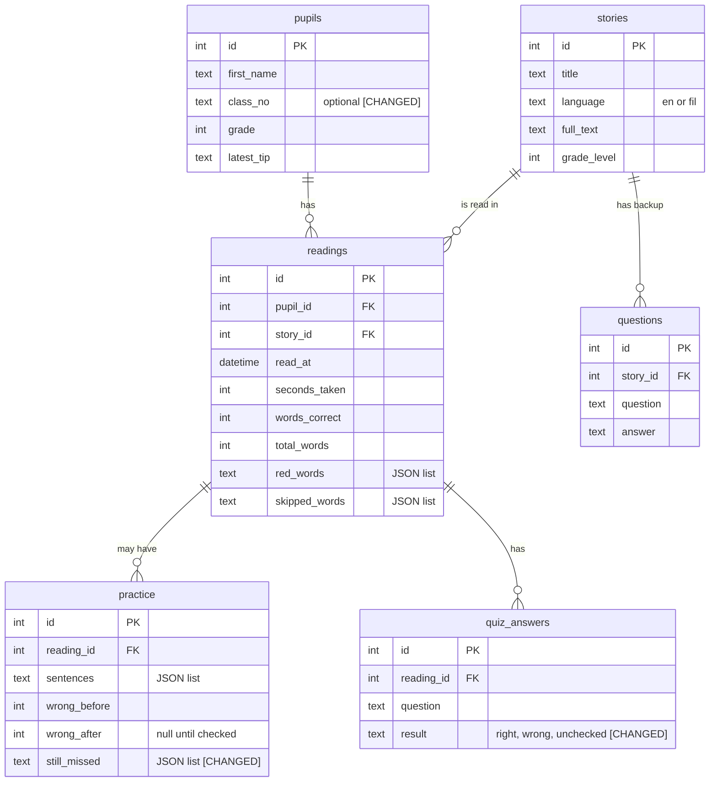
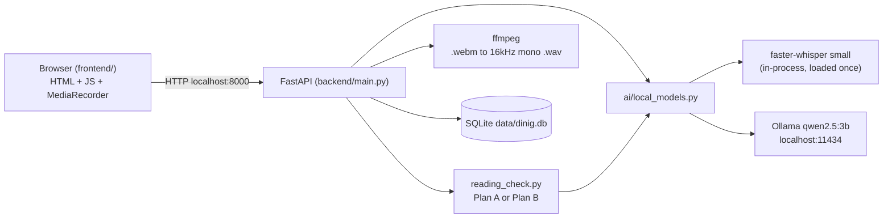

# System design

## Tech stack (chosen for this build, one sentence why for each)
- **Frontend: plain HTML, CSS and JavaScript** in `frontend/`, served by FastAPI. There is no build step and no npm, it works offline from the same server, and the browser's built-in MediaRecorder records the mic.
- **Backend: Python + FastAPI.** Python is where Whisper and the audio tools live, and FastAPI is quick to write and test.
- **Database: SQLite** (one file, `data/dinig.db`). There is no server to install, and it copies with the laptop.
- **Speech to text: faster-whisper, model "small"**, loaded **once** when the server starts. It runs well on a CPU inside the same Python process.
- **Language AI: Qwen2.5 3B via Ollama** (`qwen2.5:3b`). It is small enough for a laptop with 16GB RAM and no graphics card, and Ollama gives us a simple local HTTP API.
- **Audio conversion: ffmpeg** turns the browser's .webm into 16kHz mono .wav, which is the format Whisper needs.
- **Package manager:** pip (backend only).
- **OS:** Windows. Every command must work in the Windows terminal.

## Runs locally vs needs internet (REQUIRED in our submission)
| Part | Runs locally? | Needs internet? | Notes |
| --- | --- | --- | --- |
| Speech to text | Yes | No | Whisper small (about 470MB), faster-whisper, loaded once at startup |
| Language AI | Yes | No | Qwen2.5 3B (about 1.9GB), Ollama at localhost:11434 |
| Reading check | Yes | No | Plan A: Whisper + Python difflib. Plan B: MMS aligner (torchaudio) |
| Audio conversion | Yes | No | ffmpeg; audio deleted right after scoring |
| Backend | Yes | No | FastAPI at http://localhost:8000 |
| Database | Yes | No | SQLite file `data/dinig.db` |
| Frontend | Yes | No | Static files and bundled fonts, no CDN links |
| First-time setup | Yes | **Yes, once** | Downloading models, Python packages and fonts before the event |

## Local AI setup
- **Runtime:** Ollama (Qwen) and faster-whisper (Whisper), both on the laptop.
- **Models:**
  - Qwen2.5 3B, about 1.9GB: run `ollama pull qwen2.5:3b`
  - Whisper small, about 470MB: downloaded once by faster-whisper from Hugging Face, then loaded from a local folder (no internet at runtime)
  - Plan B only: the MMS forced aligner from torchaudio (`torchaudio.pipelines.MMS_FA`), downloaded ahead of time
- **Minimum laptop needed:** 16GB RAM, no graphics card needed, Windows.
- **Demo laptop:** OPEN QUESTION (model, RAM, processor).
- **Measured speed on our demo laptop:** OPEN QUESTION. We will measure: Done to result, quiz question time, answer check time and tip time. Only measured numbers go in the pitch.
- **Warm-up:** at startup, load Whisper and send one tiny prompt to Qwen (with Ollama `keep_alive`) so the first real request is not slow.

## Reading check module (Plan A and Plan B, and how to swap them)
All reading checks go through **one module**, `backend/reading_check.py`, which has one function:

```
check_reading(wav_path, story_text) -> list of {"word": str, "status": "green" | "red" | "grey"}
```

Nothing else in the app knows which plan is used. A setting `READING_CHECK = "plan_a"` or `"plan_b"` in `.env` picks the plan.

**Plan A (default): Whisper + difflib**
1. Whisper writes down what the child said.
2. Lowercase both texts, remove punctuation, and split them into words.
3. Run `difflib.SequenceMatcher` on the two word lists and read its opcodes:
   - `equal` → those story words are **green**
   - `replace` → those story words are **red** (the child said something else)
   - `delete` (story words with no match) → **grey** (skipped)
   - `insert` (extra words, repeats or restarts by the child) → **ignored**, never red
- Known risk: Whisper may "autocorrect" a misread word into the right one, which would make that word look correct. Our backend dev's first test decides whether this is a problem: **OPEN QUESTION.**

**Plan B (if testing shows that risk): MMS forced alignment**
- Align each story word directly to the audio with torchaudio's MMS aligner.
- A word with a low alignment score is red, and a word with no audio aligned to it is grey.
- The score cutoff is an OPEN QUESTION, to be tuned by testing.

The same module also scores the Practice Again sentences.

**AI rule:** every call to Whisper or Qwen goes through `backend/ai/local_models.py`. Nothing else talks to the models directly.

## Fallbacks (what happens when each AI step is slow or fails)
| AI step | Time limit | Fallback |
| --- | --- | --- |
| Reading check | none (core) | Friendly "Listening to your reading..." screen. If it fails: "Let's try again!" and the child records again. |
| Pupil tip (Qwen) | runs in background | A rule-based tip is saved first ("Practice: bridge, careful"), and the AI tip replaces it when ready. [CHANGED] |
| Quiz questions (Qwen) | 8 s | The 2 pre-written questions from the `questions` table |
| Answer check (Qwen) | 8 s to start, tune after measuring | Pre-written question: keyword match with the saved answer. AI question: result saved as "unchecked", and the child sees "Good thinking!" |
| Encouraging message | same as answer check | Pick from a fixed list of kind messages |
| Practice sentences (Qwen) | 8 s | Template sentences: "I can read the word ___." |
| Qwen returns bad JSON | none | Treated as a timeout, so the same fallback is used |

## Data diagram (ERD, in Mermaid)


## Main tables and what each one stores
- **pupils:** first name (or class number), grade, and the latest one-line tip. No last names, no photos, no audio.
- **stories:** title, language (`en` or `fil`), full text and grade level.
- **questions:** pre-written backup questions and their short answers (2 per story).
- **readings:** one row per Read and Check: pupil, story, date and time, seconds taken, words correct, total words, red words and skipped words.
- **practice:** one row per Practice Again: the sentences, how many words were wrong before and after, and the words still missed. [CHANGED: added `still_missed`]
- **quiz_answers:** one row per answered question: the question and the result. [CHANGED: we do **not** store what the child said, to follow the privacy rule]

**Calculated, not stored:**
- **Trouble words:** count the red words from the pupil's last 5 readings plus `still_missed` from their practice, and show the top 5.
- **Accuracy:** `words_correct / total_words`.
- **Words per minute** (extra feature): `words_correct / seconds_taken * 60`.

## Seed data for the demo
Load it by running `python backend/seed.py`, which resets the database. Screens label it "Sample class".
- **3 English stories**, Grade 3 level, 40 to 60 words each, set in a Filipino setting (for example a boat on the river, a mango tree, rain on a farm). Each has 3 or 4 harder words (for example "careful", "bridge", "carabao") so red words look realistic. The stories themselves are not written yet.
- **2 backup questions per story** (6 in total): one "what happened" question and one simple "why" question, each with a short answer.
- **10 sample pupils** (fictional first names, Grades 3 and 4), each with 3 to 5 past readings from the last 2 weeks:
  - about 3 doing well, 4 almost there and 3 needing help, so the heatmap shows all 3 colors
  - red and skipped words taken from the real story words
  - a saved tip for each pupil
- **1 demo pupil, "Mika"**, with no readings yet, so the live demo result is clearly new.
- **Extra (only if time):** 2 short Filipino stories with 2 questions each.

## API routes (proposal)
The skeleton prompt writes full request and response details into `docs/API.md`.

| Route | Feature | Request | Response |
| --- | --- | --- | --- |
| `GET /health` | setup | none | `{whisper_loaded, ollama_ready, ffmpeg_found, db_ok}` [CHANGED: added ffmpeg and db] |
| `GET /pupils` | all | none | list of `{id, first_name, class_no, grade}` |
| `POST /pupils` | Class View | `{first_name, class_no?, grade}` | the new pupil |
| `GET /stories` | Read and Check | none | list of `{id, title, language, grade_level}` |
| `GET /stories/{id}` | Read and Check | none | `{id, title, full_text}` |
| `POST /readings` | Read and Check | form: `pupil_id, story_id, seconds_taken, audio (.webm)` | `{reading_id, words:[{word,status}], words_correct, total_words, seconds_taken}`. It converts, scores, saves, deletes the audio and saves a rule-based tip, then starts the AI tip in the background. [CHANGED] |
| `GET /quiz/{reading_id}` | Story Quiz | none | `{source:"ai"/"backup", questions:[{question_id?, question}]}`, using backup questions after 8 s |
| `POST /quiz/answer` | Story Quiz | form: `reading_id, question, question_id?, audio` | `{result:"right"/"wrong"/"unchecked", message}`. Audio is deleted. [CHANGED: no transcript saved] |
| `POST /practice` | Practice Again | `{reading_id}` | `{practice_id, sentences:[...], target_words:[...], wrong_before}` |
| `POST /practice/{id}/check` | Practice Again | form: `audio` | `{words:[{word,status}], wrong_before, wrong_after, still_missed:[...]}`. "Now" counts only the target words that are still red or grey. |
| `GET /teacher/class` | Class View | none | per pupil: `{id, first_name, latest_accuracy, latest_seconds, trouble_words, tip, last5:[accuracy...], last_read_at}` |

Audio files are saved to a temp folder, and the server deletes them in a `finally` block so they are removed even when scoring fails.

## User flow (the screens a user clicks through, step by step)
**Pupil:**
1. Home: tap **I'm a Pupil**
2. Pick Your Name
3. Pick a Story
4. Read Aloud: tap **Start**, read, then tap **Done** (the timer runs between them)
5. Checking: the loading screen
6. My Result
7. Story Quiz (2 questions)
8. Practice Again (only if there are red words)
9. All Done: tap **Next Reader**, which goes back to Pick Your Name

**Teacher:**
1. Home: tap **Teacher**
2. Class View: scan the table and heatmap, read tips, add a pupil
3. Back to Home, then hand the laptop to the next pupil

## User journey (what the user feels and thinks, before, during, after)
| Stage | Teacher | Pupil |
| --- | --- | --- |
| Before | "I can't listen to 40 kids read. I don't know who is falling behind." Tired and unsure. | "Reading out loud is scary. What if I get it wrong?" Shy. |
| During | Sets up one laptop with no Wi-Fi, and pupils take turns on their own. Relieved it just works. | Big friendly buttons. Sees mostly green words, and the red ones are called "practice words". Feels proud, not judged. |
| After | Opens Class View: in one glance they see who needs help and which words to practice. Feels in control. | "I read 47 words! I fixed 2 more in practice." Wants another turn. |

## User stories
- As a **pupil**, I want to read a story aloud and see which words I got right so that I know how I did right away.
- As a **pupil**, I want kind, simple feedback so that I am not afraid to read aloud.
- As a **pupil**, I want to answer questions about the story by speaking so that I show I understood it without typing.
- As a **pupil**, I want to practice my hard words in new sentences so that I can see myself improve.
- As a **teacher**, I want to see all my pupils' latest scores and trouble words on one screen so that I know who needs help first.
- As a **teacher**, I want one plain tip per pupil so that I know what to practice without analyzing data.
- As a **teacher**, I want the app to work with no internet so that I can use it in my classroom any day.
- As a **teacher**, I want children's voices deleted after scoring so that I protect my pupils' privacy.

## How the parts connect (frontend, backend, database, local AI model)

Suggested folders: `frontend/` (index.html, app.js, styles.css, fonts/), `backend/` (main.py, db.py, reading_check.py, ai/local_models.py, seed.py), `data/`.
Open the app at **http://localhost:8000**. Use `localhost`, not an IP address, because browsers only allow the microphone on `localhost` or HTTPS.
